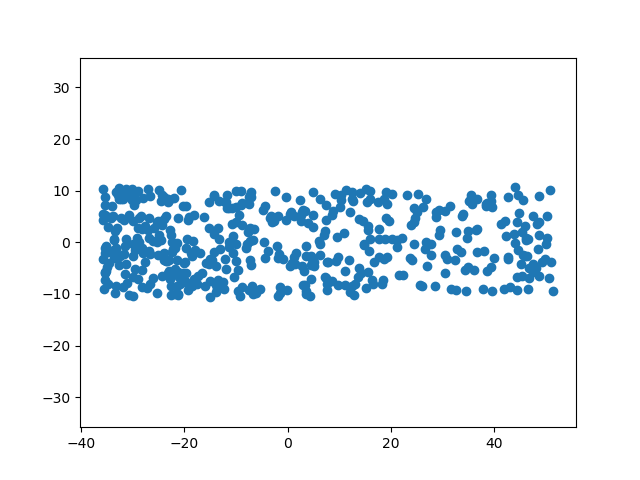
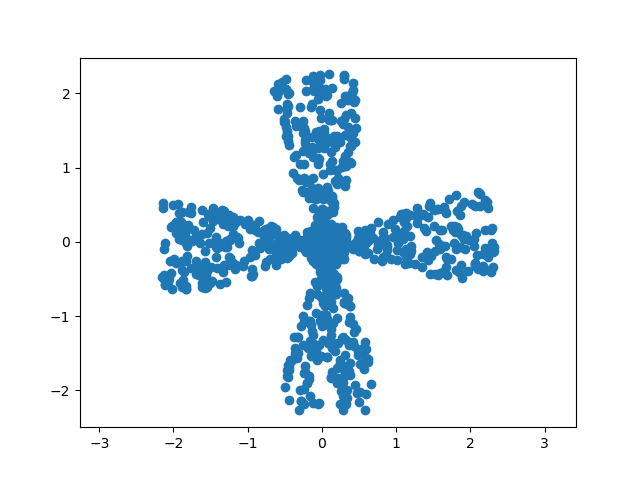
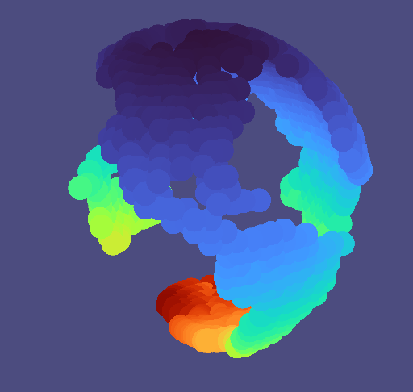
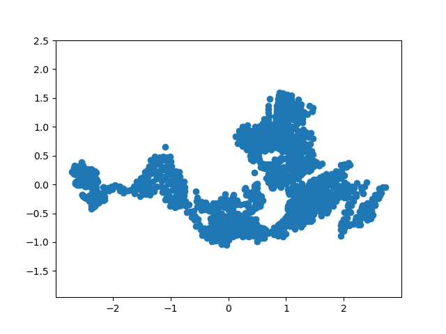

# Parallel Transport Unfolding
Parallel Transport Unfolding is an effective method to represent higher dimensional data in lower dimension by preserving local features. It results in what coud be considered an unfolded version of the higher dimensional data. Details on our implementation and results can be found in the project report pdf.

## How to use

Make sure to have access to the Libigl library. The mesh to be used as input can be changed in the main function andshould be provided as an .off file. Results then appear in the data/results.txt file, and can be visualized using the visualize.py script.

## Visuals
 

 
 

## Contributors

Hugo Bouigeon

Paul Woringer https://github.com/paulwrg